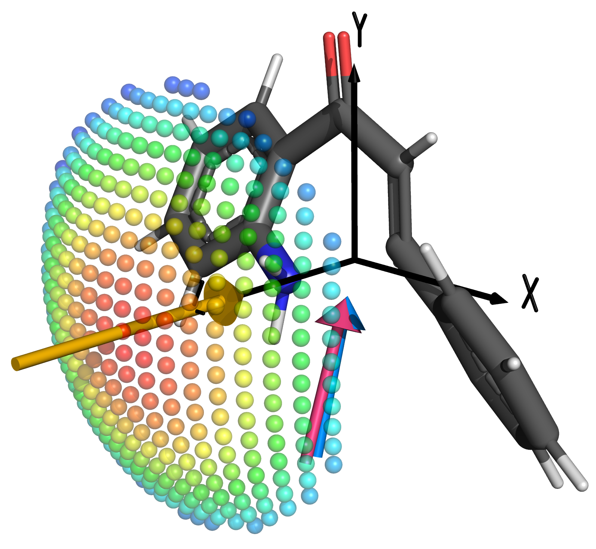

This is a repo containibng the final iPython notebooks used to generate most of the data for my honours thesis. The only things that have been excluded are my PyMOL work, as those .pse files with isosurfaces and MEPs are many gigabytes of binary data, not suitable for a github repo.

To use the notebooks form this repo, you'll need:
* matplotlib
* numpy
* colorsys
* scipy
* plotly
* ipywidgets
* pandas
* csv

*Yes, I know it's a mess of packages, but these notebooks have been slowly evolving over the year and and aren't indicative of how cleanly I actually work.*

To run the OEEF notebooks, you will need to have the included data folder in the same directory.

The pymol-scripts folder only has a couple of scriots that I've used to generate the .pse files, from the .csv files and .xyz geoms:
* pymolEfield.py - a funciton to generate the spheres representation of the OEEF scans

#### Plugin
the `pymolEfield.py` script has also had a gui developed for it, after a fun night hacking together some code with friends, and is available in the `pymol-scripts/examples` folder.

This produces figures that look like this (without the black axes. They were added separately):

|  |  |
| :------: | :------: |

The format of the CSV file is as follows:
* First row for headings (gets ignored)
* Columns with the following data
    * x component of electric field
    * y component of electric field
    * z component of electric field
    * e_kjmol of the perturbation (perturbed - unperturbed)
    * dipole(x) (D)
    * dipole(y) (D)
    * dipole(z) (D)

Electric fields need to be in atomic units following physics notation (pointing form positive to negative) and dipoles need to be in Debye, following standard chemistry notation of poiinting from negative to positive.

e.g.:

|    x     |    y     |    z     |  e_kjmol   | dipole(x)  | dipole(y)  | dipole(z)  |
| :------: | :------: | :------: | :--------: | :--------: | :--------: | :--------: |
| 0.00E+00 | 0.00E+00 | 0.00E+00 |     0      | 2.84909414 | -4.989243  | 1.57583802 |
| 1.94E-03 | 0.00E+00 | 0.00E+00 | 3.54743169 | 0.67670253 | -4.5698034 | 1.77719687 |
| 1.78E-03 | 7.91E-04 | 0.00E+00 | -0.574705  | 1.01374995 | -5.158874  | 1.74510839 |

An example Psi4 script to perturb a molecule based on a list of OEEF vectors has been provided in the `pymol-scripts/examples` folder, along with osme example .csv files