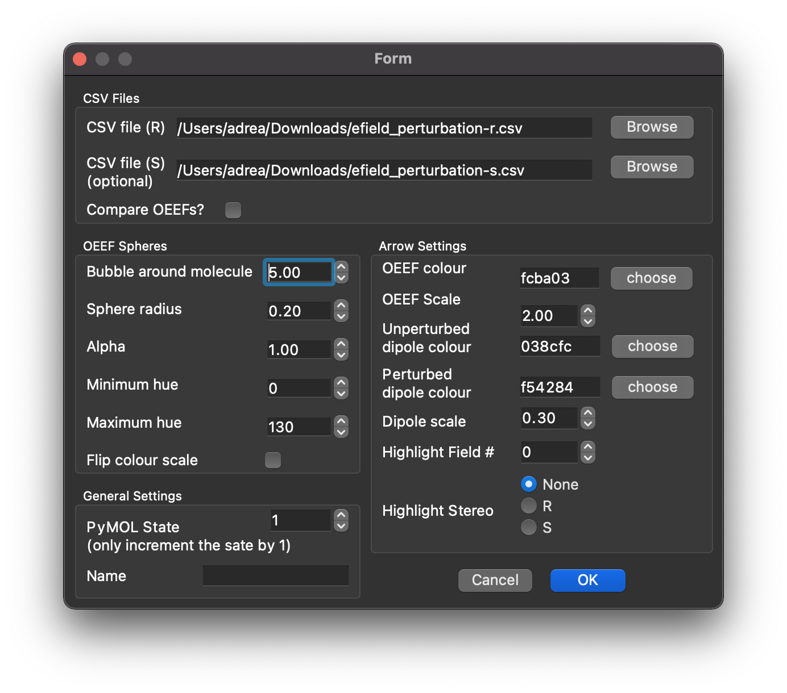

This is a repo containibng the final iPython notebooks used to generate most of the data for my honours thesis. The only things that have been excluded are my PyMOL work, as those .pse files with isosurfaces and MEPs are many gigabytes of binary data, not suitable for a github repo.

To use the notebooks form this repo, you'll need:
* matplotlib
* numpy
* colorsys
* scipy
* plotly
* ipywidgets
* pandas
* csv

*Yes, I know it's a mess of packages, but these notebooks have been slowly evolving over the year and and aren't indicative of how cleanly I actually work.*

To run the OEEF notebooks, you will need to have the included data folder in the same directory.

The pymol-scripts folder only has a couple of scriots that I've used to generate the .pse files, from the .csv files and .xyz geoms:
* pymolEfield.py - a funciton to generate the spheres representation of the OEEF scans

#### Plugin
the `pymolEfield.py` script has also had a gui developed for it, after a fun night hacking together some code with friends, and is available in the `pymol-scripts` folder.

